# GRAPHICA-UNLOCK
Graphica Unlock is a Graphical Authentication System created in Android Studio IDE using java language with attractive graphics. It is basically a graphical password authentication system for higher security purpose. This app is created to prevent privacy breach of users with a high level authentication.

This repository contains demo files of Graphica Unlock App, created in 2023. 

## 🎥 Video Demo  

## 📸 Screenshots 
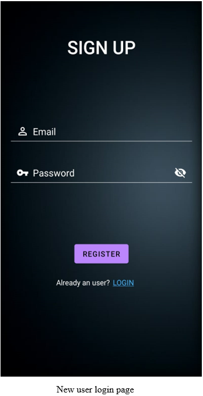
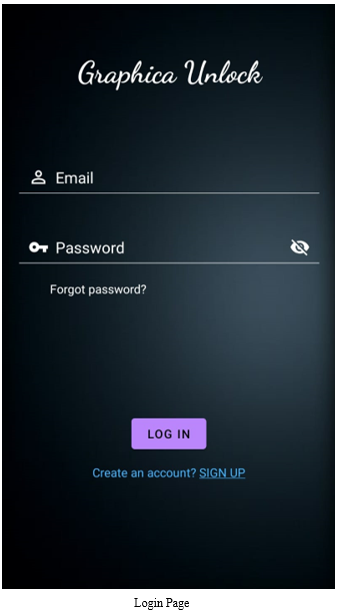
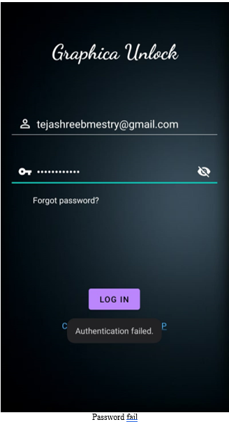
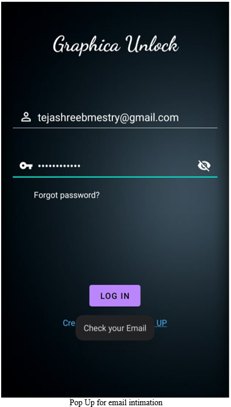
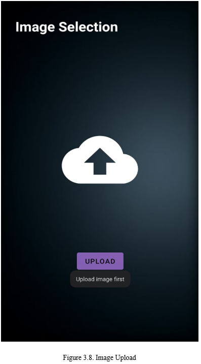
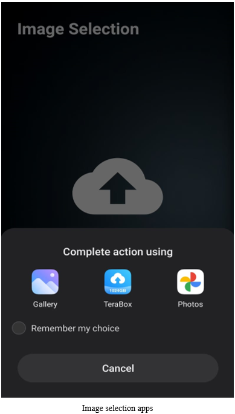
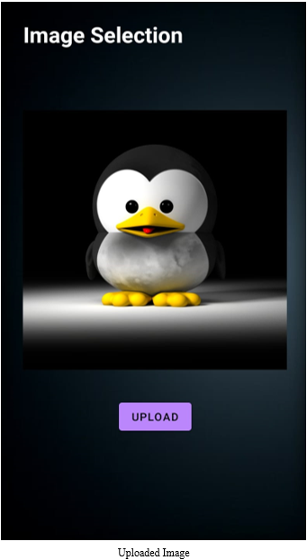
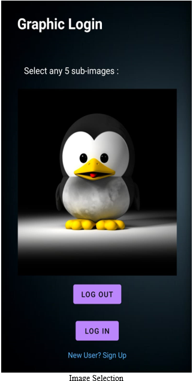
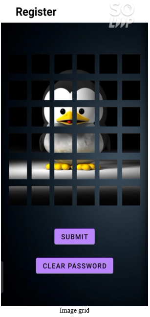
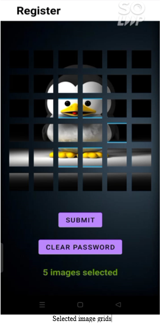
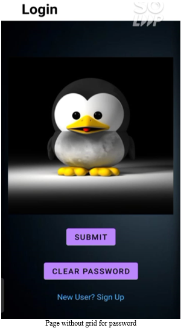
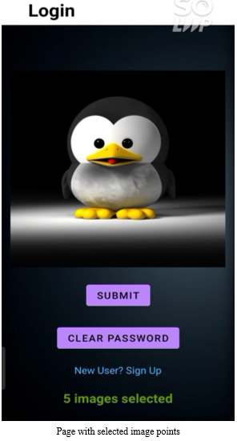
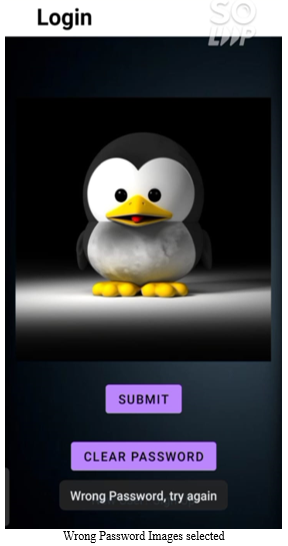
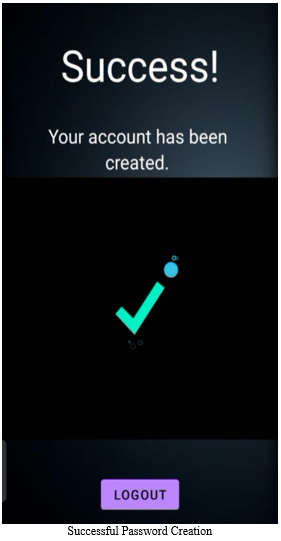

## 📄 Documentation 
The detailed project report is available [here]
